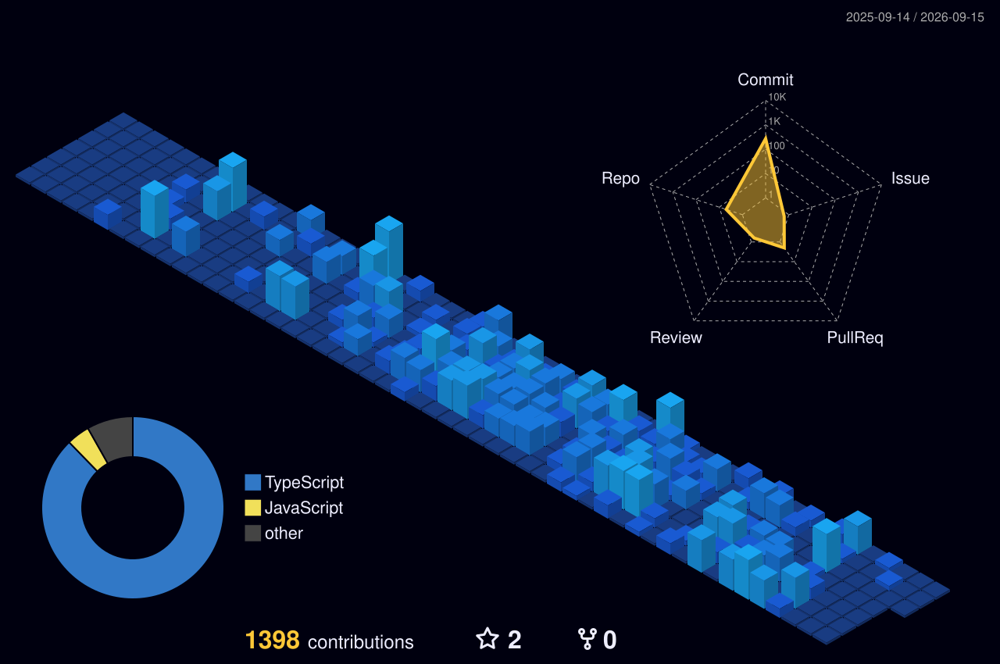

<h1 align="center">Hi there, I'm Parth Joshi 👋</h1>
<h3 align="center">Full-Stack Developer | MERN & React Native Enthusiast</h3>

  Building scalable apps, exploring new technologies, and turning ideas into real products. Based in Gujarat, India. 🌍

  
  

---

### 👨‍💻 About Me
- 🔭 I’m currently working on full-stack web and mobile applications.
- 🌱 I’m currently deep-diving into new frameworks and scalable backend architectures.
- 💬 Ask me about **JavaScript, TypeScript, React, and building RESTful APIs**.
- 📫 Reach out to me: **<a href="https://parthjoshi-dev.vercel.app" target="_blank">Visit my Portfolio</a>**

---

### 🛠️ Tech Stack & Tools

**Frontend:** 

**Backend & Database:** 

**Languages:** 

---

### 📊 GitHub Stats
---

### 🌟 Contribution Visuals

#### My 3D Contribution Graph

#### My Contribution Snake
<picture>
  <source media="(prefers-color-scheme: dark)" srcset="dist/github-contribution-grid-snake-dark.svg">
  <source media="(prefers-color-scheme: light)" srcset="dist/github-contribution-grid-snake.svg">
  
</picture>
